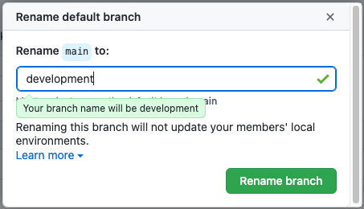

Our project for this lesson will be to create a repository to write our Data Management Plan. 

We can start repositories in many different ways. We could create a local repository in our computer, create a new repository in GitHub, or copy somebody's elses repository. Let's create our new repository from scratch. 

Sign in to https://www.github.com If you don't have an account, create one. 

Now click on the "+" icon, on the upper right, and select New repository. 

Choose a Public repository. Name the repository following this file naming convention: 

~~~
GRAD521_DMPSurname_2020 
~~~
{: .language-bash}

where Surname is your surname. 

Make sure that you tick the option Initialize this repository with a README

It will take a minute or two to be ready.

Explore the GitHub space. The first thing you will see is that there is one file in the repository: a README.md This is a markdown file. Markdown is a language to write formatted text that is very intuitive, and that is quite useful to work in GitHub, so we will use it a little bit for this lesson. The content of the README.md file is what you see under the list of files. At this point the automatic readme has only the name of the repo. 

Let's edit the README file. We will add some information about what the repository will be. 

~~~
Data Management Plan for the research project Biogeochemical model of the Columbia River Estuary.

Context of the project:

~~~
{: .language-bash}

Under Context of the project add the description of your research project that you wrote for the assignment DMP Part 1. Remember that this document is public, do not include any information that cannot be shared publicly.

To save the changes go to the very bottom of the page. You have the option of including a short description and an optional extended description. You should always add a short description, and this short description should be meaningful, because this will be the metadata that will help you keep a good control of the different versions of your files.

Let's explore the repository a little more. You will see a tab named "branches". This repository has only one branch that, by default, is named "master". 
Since this default name has racist connotations let's change it to "main" instead. Find the branches tab, and click on the little triangle. Then click on "View all branches". 

Find the pencil button next to the branch "master" and click it. 

Type the new name, and click on "Rename branch". Common possibilities for your new branch are "main", or "development" or "trunk". You can chose any name you want. 

We will not go over branches during this lesson. There is also a tab named "commits". A "commit" is a different version of the content in the repository. You can modify the files, and when you are done you submit the changes as commit. GitHub shows a lot of information about each commit:
* Date
* Author
* Description
* Unique identifier for the commit

Clicking on the commit also shows us a visualization of the changes that were made on this particular commit. 

