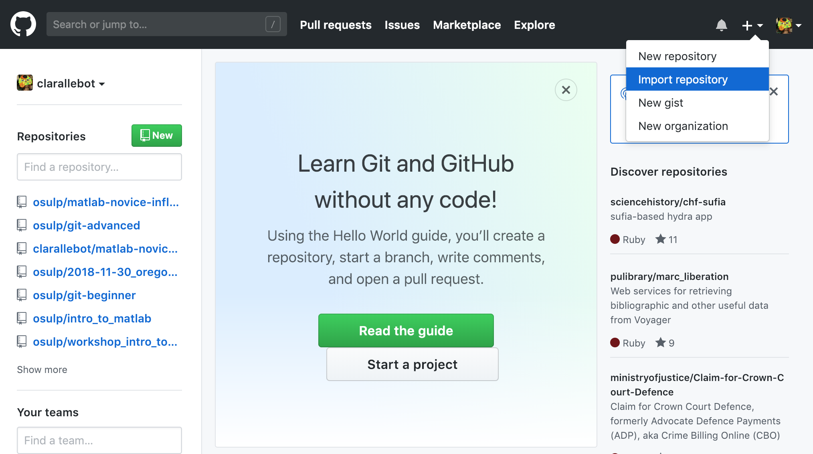
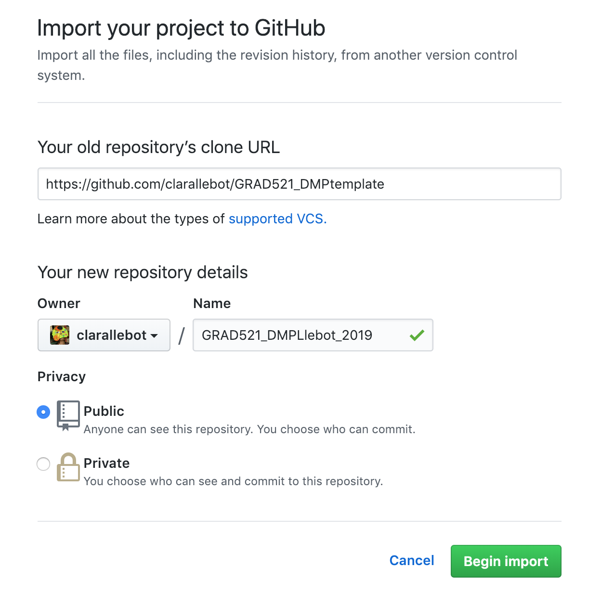
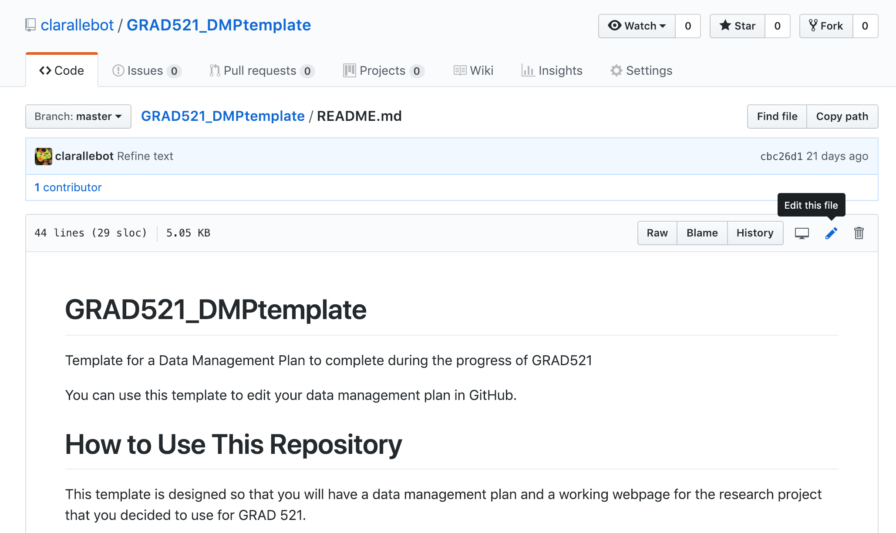
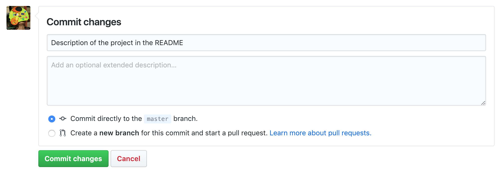

Our project for this lesson will be to create a repository to write our Data Management Plan. 

We can start repositories in many different ways. We could create a local repository in our computer, create a new repository in GitHub, or copy somebody's elses repository. Let's copy an already existing repository. 

I have created a template repository in https://github.com/clarallebot/GRAD521_DMPtemplate that you will import to your account.

Sign in to https://www.github.com If you don't have an account, create one. 

Now click on the "+" icon, on the upper right, and select Import repository. 

Under "Your old repository’s clone URL" add the URL of the repository. Choose a Public repository. Give it a name following this file naming convention: 

~~~
GRAD521_DMPSurname_2019 
~~~
{: .language-bash}

where Surname is your surname. It will take a minute or two to be ready.

When you import a repository you are saving a copy of another repository, including files, and history. You created a new repository, and that means that you can modify it as you wish without affecting the original repository. (Of course, if you do that with other repositories make sure to check the terms of use or license).

Explore the GitHub space. The first thing you will see is that there are two files in the repository: a README.md and an index.md These are markdown files. Markdown is a language to write formatted text that is very intuitive, and that is quite useful to work in GitHub, so we will use it for this lesson. The content of the README.md file is what you see under the list of files. 

To edit files in GitHub click on the pencil on the top right of the document. When you click the edit button you will see the document in plain text. Let's edit the README file. We will remove all the text, and add some information about what the repository will be. 

~~~
Data Management Plan for the research project Biogeochemical model of the Columbia River Estuary.

Context of the project:

~~~
{: .language-bash}

Under Context of the project add the description of your research project that you wrote for the first piece of homework. Remember that this document is public, do not include any information that cannot be shared publicly.

To save the changes go to the very bottom of the page. You have the option of including a short description and an optional extended description. You should always add a short description, and this short description should be meaningful, because this will be the metadata that will help you keep a good control of the different versions of your files.

Let's explore the repository a little more. You will see a tab named "branches". This repository has only one branch that, by default, is named "master". We will not go over branches during this lesson. There is also a tab named "commits". A "commit" is a different version of the content in the repository. You can modify the files, and when you are done you submit the changes as commit. GitHub shows a lot of information about each commit:
* Date
* Author
* Description
* Unique identifier for the commit

Clicking on the commit also shows us a visualization of the changes that were made on this particular commit. 

