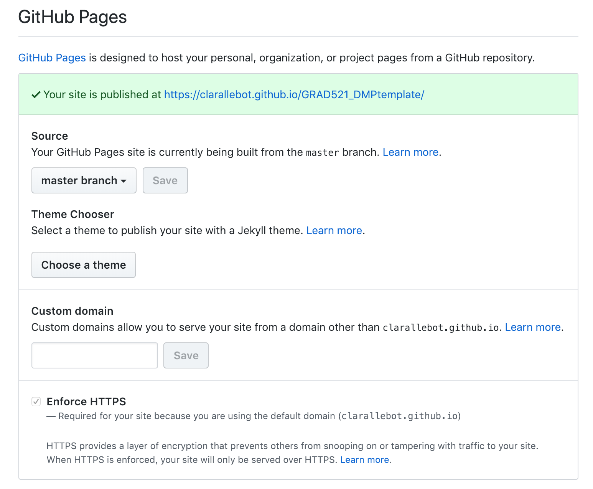

You can use GitHub to host a website. This does not have much to do with version control at all, but it is a nice feature of GitHub that we will use in this particular project.

Locate the "Settings" tab in your project, and then navigate to GitHub pages. In this case, you imported the repository and this setting was already activated. If you had started the repository from scratch you would have needed to activate it. What we can see in this section is that GitHub will use the files in the "master" branch (the only one we have so far) to render the website. We have not chosen any Jeckyll themes, and we have not created a custom domain. Feel free to play with these.

The most important piece of information at this point is at the top of the section, where it says "Your site is published at". Copy the URL. Now navigate to the home page of your project, and click on the "Edit" button under the tabs. Include a short description of your project, and paste the URL on the Website space. 

This is just a handy place where to keep the URL of your website. The structure of your website will be something like

~~~
https://username.github.io/GRAD521_DMPSurname_2019
~~~
{: .language-bash}

Now visit the website. It should look like this:

Now go back to your repository and look at the file index.md This is the file that is being shown in the website. Not that beautiful (yet), but the information is there. 

> ## Understanding markdown
> What can you deduce about the way that sections are structured in Markdown by looking at the file and at the rendered website?
> > ## Solution
> > Sections are designated with `#` signs. Add more to create subsections (`##`, and `###`...) 
> {: .solution}
{: .challenge}

When you make a change in the files of your repository, the change will be transfered to the website. It does take some time (a few minutes) for the changes to appear in the website, so do not be surprised if you do not see your most recent changes right away. 

You will need to complete your DMP for the next DMP homework assignments in this GitHub site that you just created. During this lesson we will add the content you already created for assignments DMP Part 1 and DMP Part 2. Make sure to remove any information that you do not want to make public. 

