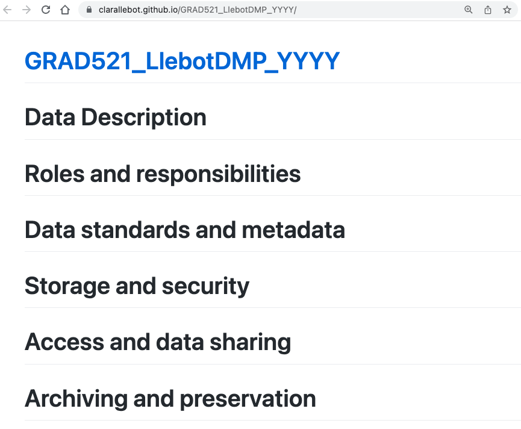

You can use GitHub to host a website. This does not have much to do with version control at all, but it is a nice feature of GitHub that we will use in this particular project.

Locate the "Settings" tab in your project, and then navigate to Pages on the left hand side menu. 

To activate GitHub Pages, so that GitHub will create a website from this repository, we need to chose our "main" branch as the source. We have not chosen any Jeckyll themes, and we have not created a custom domain. Feel free to play with these, but it is not a requirement of this class to make your page beautiful.

After saving it, GitHub will tell us the name of the website where the repository will be rendered, where it says "Your site is published at". Copy the URL. 

Now navigate to the home page of your project, and edit the "About" section. Paste the URL on the Website space. If you wish to include a short description of your project you can also do it here.

This is just a handy place where to keep the URL of your website. The structure of your website will be something like

~~~
https://username.github.io/GRAD521_DMPSurname_YYYY
~~~
{: .language-bash}

Right now if you navigate to the website, you will see the contents of the readme, because it is the only file in our repository. Let's create some content for this website. Go back to the <> Code section of your repository, and click on "Add file" and "Create new file". 

Give the file the name index.md. Make sure that you name your file exactly index.md, the first letter must be lower case or it won't work. Enter some content:

~~~
# Data Description
# Roles and responsibilities
# Data standards and metadata
# Storage and security
# Access and data sharing
# Archiving and preservation
~~~
{: .language-bash}

Make sure that you include a commit message when you save. 

Now visit the website that we copied when we activated GitHub pages. It should look like this:

Now go back to your repository and look at the file index.md This is the file that is being shown in the website. Not that beautiful (yet), but the information is there. 

> ## Understanding markdown
> What can you deduce about the way that sections are structured in Markdown by looking at the file and at the rendered website?
> > ## Solution
> > Sections are designated with `#` signs. Add more to create subsections (`##`, and `###`...) 
> {: .solution}
{: .challenge}

In this document we are using a little bit of Markdown. The pound sign means that each of these sentences will be a section. You don't need to do any fancy editing for this assignment, but here are some Markdown instructions that may be useful:

- Make sure that you leave a space between the pound sign and the text, otherwise it won't work.
- If you want to add subsections you can do so by adding two pound signs instead of one. 
- To add a new paragraph you need to leave an empty blank line.
- Here is a [Markdown cheat sheet for GitHub](https://github.com/adam-p/markdown-here/wiki/Markdown-Cheatsheet). 

When you make a change in the files of your repository, the change will be transfered to the website. It does take some time (a few minutes) for the changes to appear in the website, so do not be surprised if you do not see your most recent changes right away. 

You will need to complete your DMP for the next DMP homework assignments in this GitHub site that you just created. During this lesson we will add the content you already created for assignments DMP Part 1 and DMP Part 2. Make sure to remove any information that you do not want to make public. 

