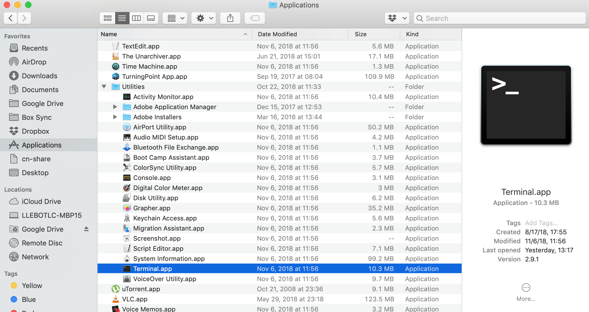

Until this moment we have used Git through GitHub. But Git and GitHub are not the same. Git is a version control software that does not need GitHub to operate. There are several other repositories that you could choose to use, like [Bitbucket](https://bitbucket.org/) or [Gitlab](https://about.gitlab.com/). 

There are many ways of using Git, and many pieces of software integrate it in their workflow. During the rest of this session, though, we are going to work with Git from the command line. It is the best way of understanding its potential, and to not be confused by the particularities of certain tools. You are not required to use the command line to edit your GitHub repository for this week's assignment. 

The first thing we need to do is to open the command line. 
In a Mac this is done by goint to Applications, Utilities, Terminal.

In a Windows this is done by looking at the list of the programs, finding Git, and choosing Git Bash.

When we use Git on a new computer for the first time,
we need to configure a few things. Below are a few examples
of configurations we will set as we get started with Git:

*   our name and email address,
*   to colorize our output,
*   and that we want to use these settings globally (i.e. for every project)

On a command line, Git commands are written as `git verb`,
where `verb` is what we actually want to do. So here is how
to set up git:

~~~
$ git config --global user.name "Name Surname"
$ git config --global user.email "surnamen@oregonstate.edu"
$ git config --global color.ui "auto"
~~~
{: .bash}

This user name and email will be associated with your subsequent Git activity,
which means that any changes pushed to
[GitHub](http://github.com/),
[BitBucket](http://bitbucket.org/),
[GitLab](http://gitlab.com/) or
another Git host server
in a later lesson will include this information.
If you are concerned about privacy, please review [GitHub's instructions for keeping your email address private][git-privacy].

> ## Exiting Vim
>
> Note that `vim` is the default editor for for many programs, if you haven't used `vim` before and wish to exit a session, type `Esc` then `:q!` and `Enter`.
{: .callout}

The three commands we just ran above only need to be run once: the flag `--global` tells Git
to use the settings for every project, in your user account, on this computer.

You can check your settings at any time:

~~~
$ git config --list
~~~
{: .bash}

You can change your configuration as many times as you want: just use the
same commands to choose another editor or update your email address.

> ## Proxy
>
> In some networks you need to use a
> [proxy](https://en.wikipedia.org/wiki/Proxy_server). If this is the case, you
> may also need to tell Git about the proxy:
>
> ~~~
> $ git config --global http.proxy proxy-url
> $ git config --global https.proxy proxy-url
> ~~~
> {: .bash}
>
> To disable the proxy, use
>
> ~~~
> $ git config --global --unset http.proxy
> $ git config --global --unset https.proxy
> ~~~
> {: .bash}
{: .callout}

> ## Git Help and Manual
>
> Always remember that if you forget a git command, you can access the list of command by using -h and access the git manual by using --help :
>
> ~~~
> $ git config -h
> $ git config --help
> ~~~
> {: .bash}
{: .callout}

[git-privacy]: https://help.github.com/articles/keeping-your-email-address-private/
